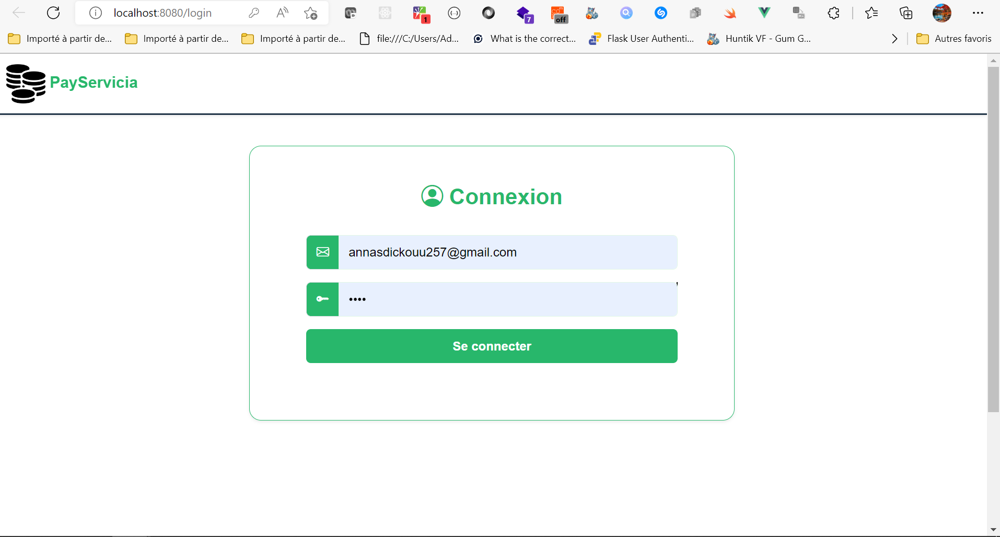
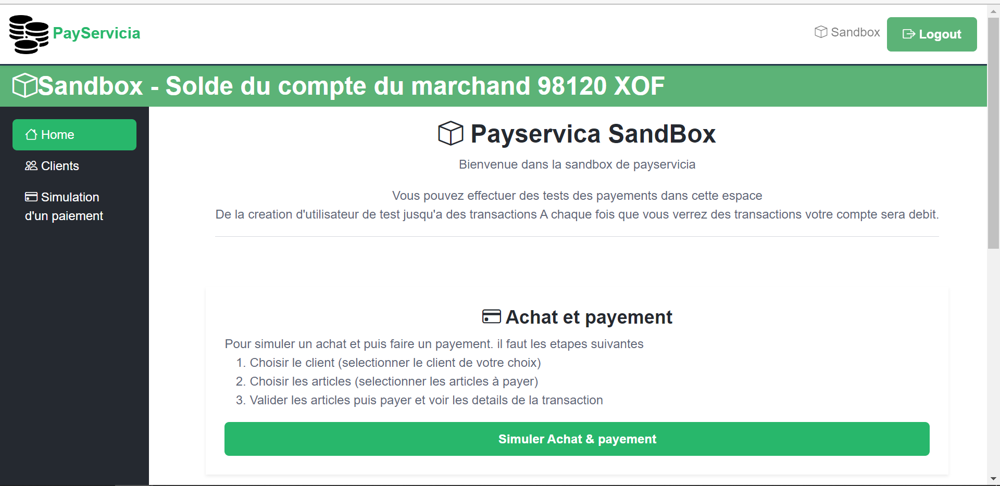
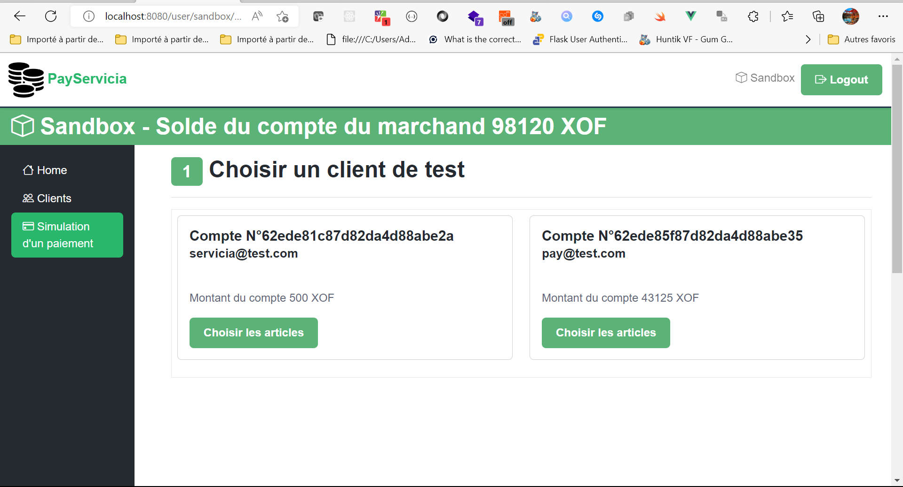
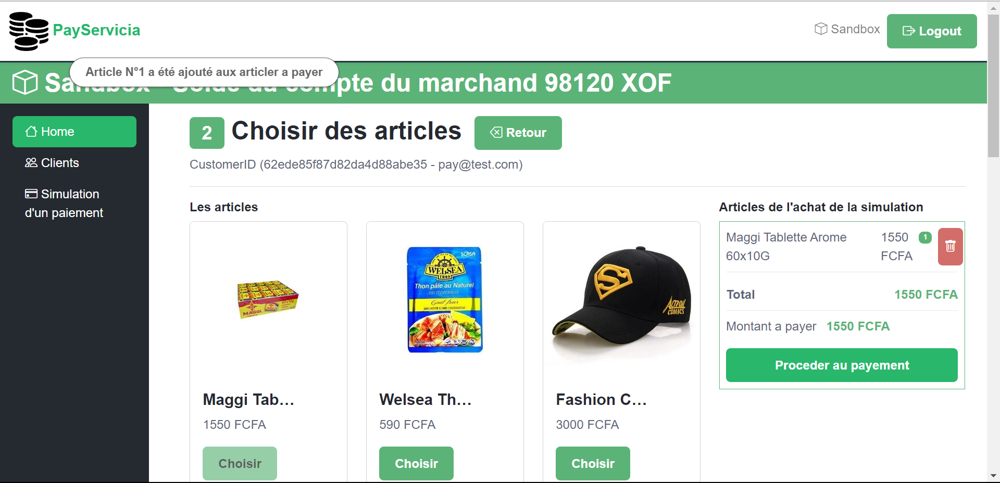
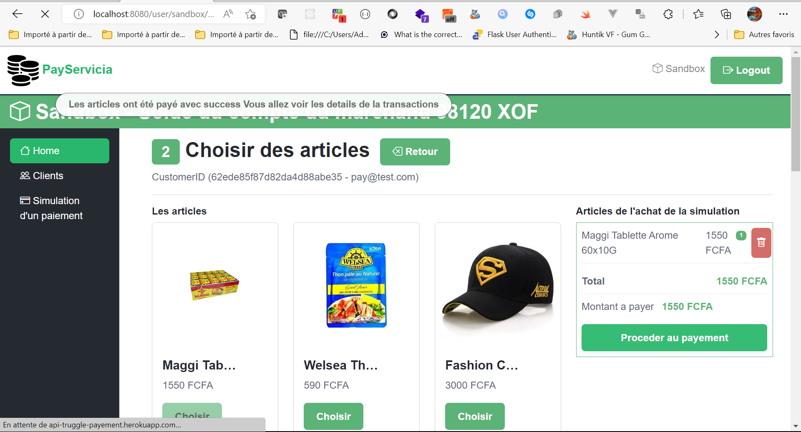
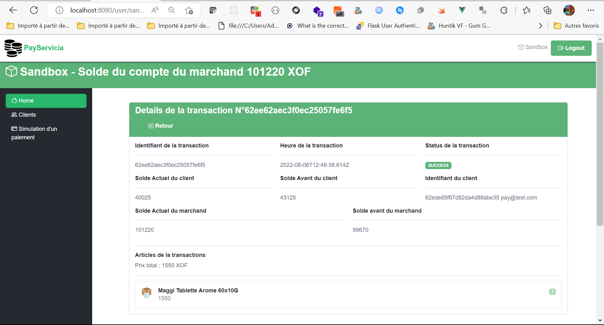

# Test de l'application payservica
Tester l'application payservicia de bout en bout.

# Code Fournis
Le code minimal a testé se trouve dans le dossier **app**.

# Demarrage
Rendez vous dans le dossier **app** puis lancer le script 
**start_server.sh** ou **start_server.bat**selon votre systeme.
Si cela ne fonctionne pas  lancer les commandes suivantes :

1. `npm install` pour lancer les dependances npm
2. `npm run serve` pour demarrer le server

`http://localhost:8080/`est l'adresse du serveur de test par defaut
Regarder l'adresse fournie par le serveur demarrer dans le console pour lancer l'application.

# Connexion au compte du marchand

Entrer les identifiants du marchand qui se trouve dans le le fichier *user_credentials.txt*

# Page de la sandbox

Suivre le workflow pour faire le payement

# Workflow à suivre pour simuler le payement
1.  Cliquer sur le bouton **Simuler Achat & payement*** 

2.  Choisir le client a test pour faire la transaction

3.  Chosir les articles 

4.  Cliquer sur le bouton ***Procceder au payement** 

# Details de la transactions
Une fois les articles payes vous verez un message de success ou d'erreur s'afficher.
Vous serrez rediriger vers la page du detail de la transaction initiée.

